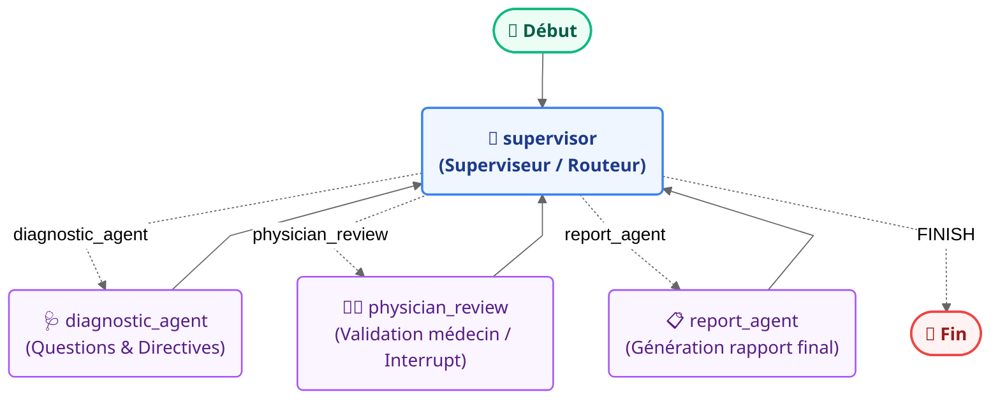

# Visualisation du Graphe Multi-Agents (LangGraph)

Ce guide vous présente les différentes manières de visualiser et de comprendre la structure multi-agents de notre application d'orientation clinique préliminaire.

---

## 1. Visualisation Directe (Diagramme Mermaid)

Voici la structure exacte du graphe d'agents générée dynamiquement par LangGraph. Elle met en évidence le rôle central du **Supervisor** (le superviseur) qui orchestre le flux d'exécution et gère la transition entre les différents agents spécialisés :



### Explication du flux :
1. **Début (`START`)** : L'exécution commence et passe immédiatement la main au **supervisor**.
2. **supervisor** : Analyse l'état de la session (les réponses du patient, l'évaluation intermédiaire) et décide conditionnellement quel agent exécuter ensuite :
   - Si la collecte d'informations (5 questions du patient) est en cours ou incomplète : il redirige vers le **diagnostic_agent**.
   - Dès que la synthèse intermédiaire est prête et doit être validée : il redirige vers le **physician_review** (qui déclenche une interruption humaine *Human-in-the-loop*).
   - Une fois l'avis médecin collecté : il redirige vers le **report_agent** pour générer le document final.
   - Une fois le rapport prêt : il oriente vers la **Fin (`END`)**.
3. **Retour au superviseur** : Chaque agent réinjecte son résultat dans l'état partagé puis repasse le contrôle au **supervisor** pour la décision suivante.

---

## 2. Utilisation de LangGraph Studio (Recommandé en local)

**LangGraph Studio** offre une interface utilisateur interactive spectaculaire pour visualiser le graphe, inspecter l'état de chaque nœud en temps réel, déboguer et interagir avec les interruptions (*interrupts*).

### Étape 1 : Lancer le serveur de développement LangGraph

Un script automatisé PowerShell est déjà présent dans le projet pour configurer l'environnement et démarrer LangGraph :

```powershell
.\scripts\run_langgraph_studio.ps1
```

> [!TIP]
> **Alternative manuelle (Powershell/Bash) :**
> Si vous préférez le lancer manuellement, exécutez ces commandes depuis la racine du projet :
> ```bash
> # Activer l'environnement virtuel
> .venv\Scripts\activate
> 
> # Définir le PYTHONPATH
> set PYTHONPATH=%CD%
> 
> # Naviguer dans le backend et démarrer
> cd backend
> langgraph dev --host 127.0.0.1 --port 8123
> ```

### Étape 2 : Ouvrir l'interface graphique

Une fois le serveur démarré, ouvrez votre navigateur et visitez l'URL suivante pour visualiser le graphe en direct et tester les interactions :

👉 **[Accéder à LangGraph Studio](https://smith.langchain.com/studio/?baseUrl=http://127.0.0.1:8123)**

---

## 3. Génération d'une image locale par script

Si vous souhaitez exporter ou sauvegarder la structure sous forme d'image PNG :
1. Assurez-vous d'avoir installé les outils graphiques système requis (`graphviz` ou similaire, facultatif).
2. Vous pouvez générer les octets de l'image en exécutant ce snippet Python :
   ```python
   from backend.app.graph import get_graph
   
   # Récupère l'instance du graphe compilé
   graph = get_graph()
   
   # Génère l'image PNG (nécessite pygraphviz ou mermaid.ink via HTTP)
   png_bytes = graph.get_graph().draw_mermaid_png()
   
   # Sauvegarde de l'image
   with open("docs/graph.png", "wb") as f:
       f.write(png_bytes)
   ```
